<div align="center">

# Thermal Camera for Flipper Zero

**Turn your Flipper Zero into a pocket thermal camera with an MLX90640 32×24 infrared sensor.**

[](https://github.com/YOUR_GITHUB_USERNAME/flipper-thermal-camera/actions/workflows/build.yml)
[](LICENSE)
[](https://flipperzero.one)
[](docs/CHANGELOG.md)

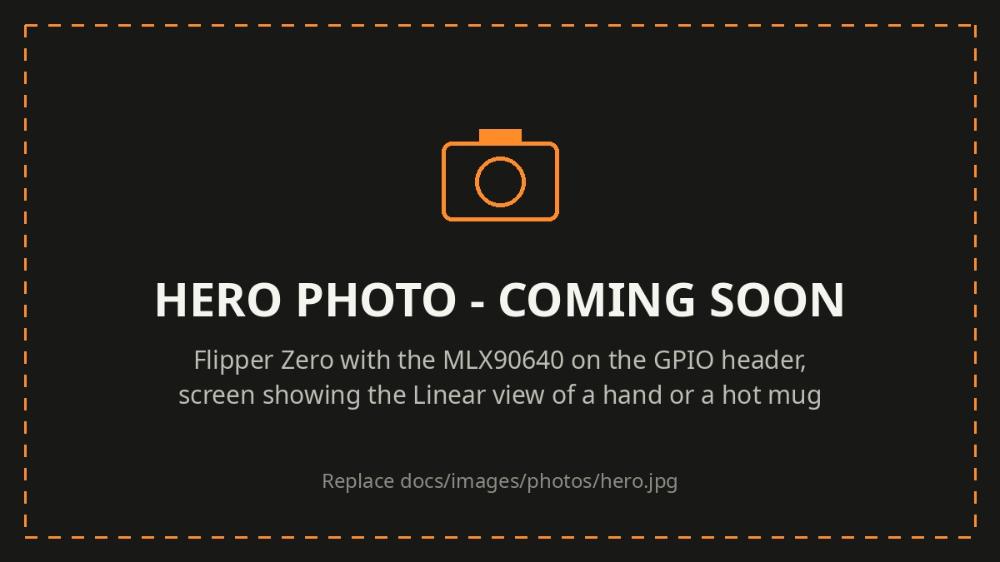

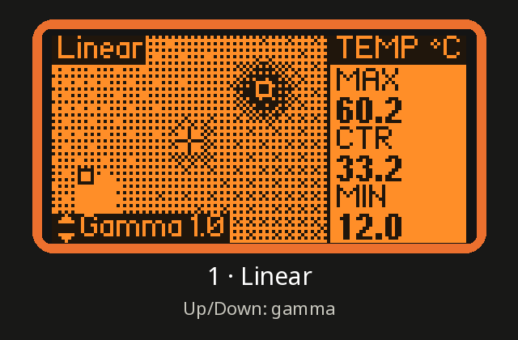

</div>

---

## Features

**On the Flipper**

- 🔥 **Live thermal image** on the Flipper screen, with smooth dithered greyscale
- 🌡️ **Max, centre and min temperatures** at a glance, with markers on the image
- 🎛️ **Nine view modes** on Left/Right: Linear, Inverted, Histogram EQ, Contour, Threshold, Spot meter, Human, USB and Bluetooth
- ↕️ **Up/Down always adjusts the current mode's setting**: gamma, EQ strength, contour step, threshold, spot size, body offset or refresh rate
- 🎯 **Spot meter** with a large readout and a temperature-history graph (10 s to 10 min). Save the graph as CSV, or log it continuously
- 🧑 **Human mode**: body-temperature screening estimate with LED and vibration alerts (*not a medical device*)
- 💾 **Save stills** as colour **PNG** or **TIFF** (five palettes) plus raw **CSV** temperatures
- 🎬 **Hold OK to record** an animation (PNG sequence or raw data)

**On your computer**

- 🖥️ **Live streaming** over **USB** or **Bluetooth** to a browser viewer, with no install and no drivers
- 📐 Measurement points and boxes, temperature-over-time graph, histogram, isotherm, °C/°F
- ⏪ **Save the last 10 s – 5 min** after the fact as video, CSV or raw data
- 🕹️ Control the Flipper from the browser: emissivity, refresh rate, recording, snapshots

<div align="center">
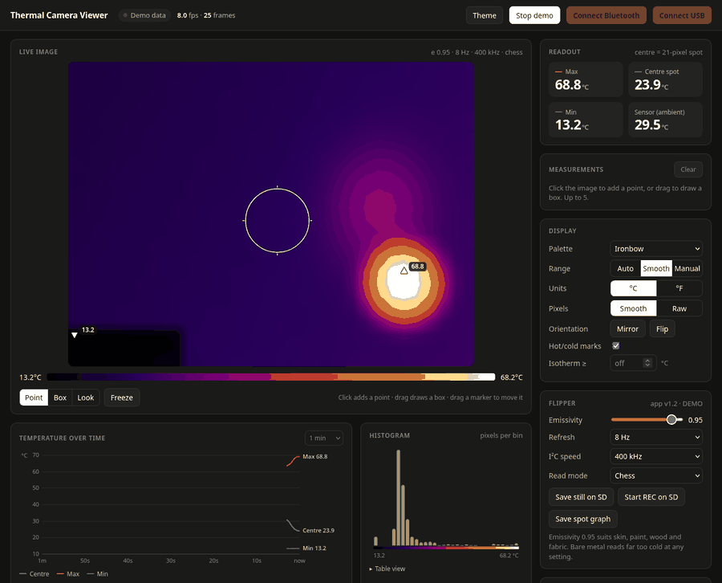
</div>

---

## Contents

- [What you need](#what-you-need)
- [Wiring](#wiring)
- [Installing](#installing)
- [Controls](#controls)
- [View modes](#view-modes)
- [Streaming to your computer](#streaming-to-your-computer)
- [Settings](#settings)
- [Saved files](#saved-files)
- [Troubleshooting](#troubleshooting)
- [Building from source](#building-from-source)
- [License and credits](#license-and-credits)

---

## What you need

| Item | Notes |
|---|---|
| Flipper Zero | Official firmware. Momentum and Unleashed also work when built with their SDK |
| MLX90640 breakout board | **BAA** (110° wide angle) or **BAB** (55° narrow). Adafruit, Pimoroni, SparkFun and generic boards all work |
| 4 jumper wires | Female–female for most breakouts |
| *Optional:* two 2.2 kΩ–4.7 kΩ resistors | For reliable 400 kHz operation (see [Wiring](#wiring)) |
| *Optional:* a computer | For the live viewer: Chrome, Chromium or Edge |

---

## Wiring

Connect four wires between the sensor board and the Flipper's top GPIO header.

| MLX90640 board | Flipper pin | Signal |
|---|---|---|
| **VIN** / 3V3 | **9** | 3.3 V power |
| **GND** | **18** (or 8 / 11) | Ground |
| **SDA** | **15** (C1) | I²C data |
| **SCL** | **16** (C0) | I²C clock |

<div align="center">
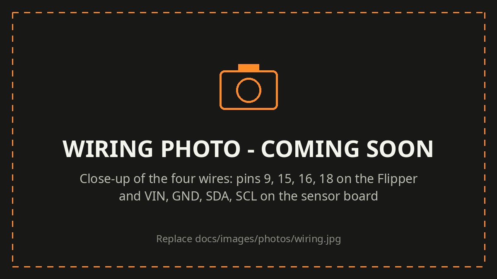
</div>

> [!WARNING]
> **Use pin 9 (3.3 V), not pin 1 (5 V).** The MLX90640 is a 3.3 V part. Some breakouts tolerate 5 V, but bare modules do not.

> [!TIP]
> **Pull-ups:** the Flipper has none on these pins, so the bus relies on the ones on your breakout. They are usually fine at 100 kHz. For a stable **400 kHz** (about 3× the frame rate), add 2.2 kΩ–4.7 kΩ from SDA and SCL to 3.3 V and keep the wires under ~10 cm. If you see `I2C error`, set **I2C Speed → 100 kHz**.

If the sensor is missing or miswired, the app shows this reminder until it answers:

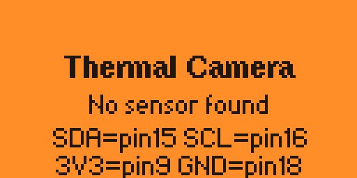

---

## Installing

### From the Flipper Apps Catalog

Search for **Thermal Camera** in the [Flipper mobile app](https://flpr.app/) or at [lab.flipper.net/apps](https://lab.flipper.net/apps) and press **Install**. The app appears under **Apps → GPIO → Thermal Camera**.

### From a release

Download `thermal_cam.fap` from the [Releases](../../releases) page and copy it to `SD Card/apps/GPIO/` with qFlipper or a card reader.

> [!NOTE]
> A `.fap` built for one firmware version may refuse to start on another (*API mismatch*). The catalog builds it for your firmware automatically; otherwise [build from source](#building-from-source).

---

## Controls

| Key | Action |
|---|---|
| **OK** (press) | Save a still image. In Spot mode, the graph is saved too. In USB / Bluetooth mode: start / stop streaming |
| **OK** (hold) | Record while held; release to stop |
| **Left / Right** | Change view mode |
| **Up / Down** | Adjust the current mode's setting (hold to repeat) |
| **Back** (press) | Settings |
| **Back** (hold) | Exit (the app closes when you let go). Also: Settings → **Exit App** |

A small **⇕ badge** on every screen shows what Up/Down controls and its current value.

---

## View modes

Press **Left / Right** to cycle through the modes. The number in the top-left badge shows where you are.

| # | Mode | What you see | **Up / Down** changes | Range | Default |
|---|---|---|---|---|---|
| 1 | **Linear** | Dithered image, hot = dense dots | Gamma | 0.4 – 2.5 | 1.0 |
| 2 | **Inverted** | Same, hot = light | Gamma | 0.4 – 2.5 | 1.0 |
| 3 | **Hist EQ** | Contrast spread evenly across the scene | EQ strength | 0 – 100 % | 100 % |
| 4 | **Contour** | Lines of equal temperature | Contour step | 0.5 – 10 ° | 2 ° |
| 5 | **Threshold** | Only pixels that pass the threshold | Threshold temperature | −40 – 300 °C | 40 °C |
| 6 | **Spot** | Big temperature readout + history graph | Spot size | 1, 3, 5, 7 px | 5 px |
| 7 | **Human** | Estimated body temperature + status | Body offset | −2.0 – +5.0 ° | +1.0 ° |
| 8 | **USB** | Streaming status | Refresh rate | 0.5 – 64 Hz | 8 Hz |
| 9 | **Bluetooth** | Streaming status | Refresh rate | 0.5 – 64 Hz | 8 Hz |

Changes made with Up/Down are saved and stay in sync with **Settings**.

### Image modes

In every image mode, the sidebar shows **MAX**, **CTR** (centre) and **MIN**. On the image, **■** marks the hottest spot, **□** the coldest, and **+** the centre.

| | |
|:---:|:---:|
| 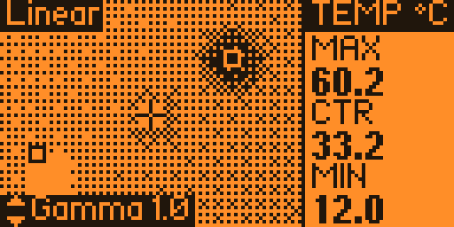 | 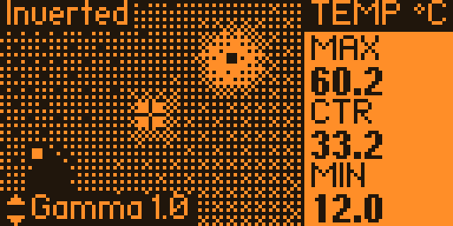 |
| **Linear**: gamma above 1.0 spends more shades on the hot end, below 1.0 on the cold end | **Inverted**: the same image with light and dark swapped |
| 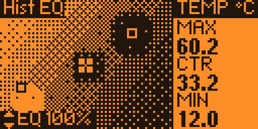 | 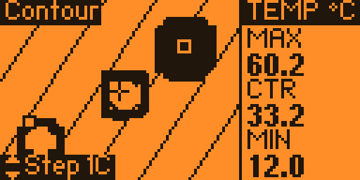 |
| **Hist EQ**: best when the whole scene is within a few degrees | **Contour**: each line is a fixed temperature, so lines stay put when the scene changes |
| 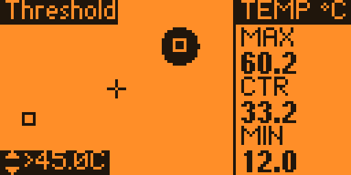 | 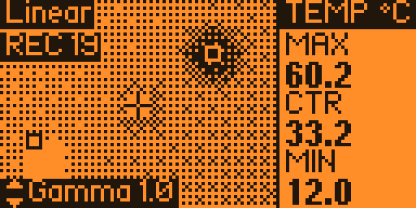 |
| **Threshold**: only pixels above the set temperature. In *Band* mode, Up/Down slides the whole band | **Recording**: hold OK; the badge counts frames |

### Spot meter

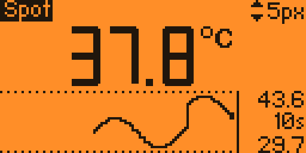

- **Big number:** average temperature of a small disc at the centre. **Up/Down** changes its diameter: 1 px for small targets, 7 px for a steadier reading.
- **Graph:** the spot temperature over the last **Graph Time** (10 s – 10 min). The right column shows the window's max, length and min.
- **OK** saves a still **and the graph** as `IR_<time>_graph.csv`.
- **Graph Log** (Settings) keeps a continuous record in `LOG_<time>.csv`, which is ideal for long monitoring.

With the wide-angle BAA sensor, one pixel covers about 3.4°. A 5 px spot at 1 m is roughly a 30 cm circle, so get close to small objects.

<div align="center">
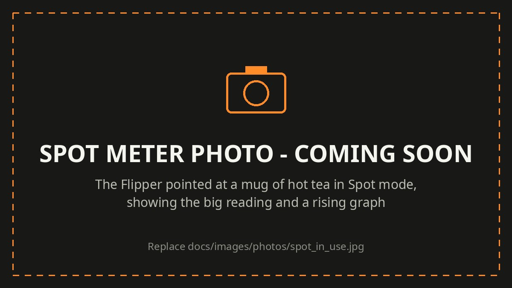
</div>

### Human mode

> [!CAUTION]
> **Not a medical device.** This is a rough screening estimate from a 32×24 sensor and can be wrong by a degree or more. Never use it to diagnose anyone; confirm any reading with a clinical thermometer.

- Face the sensor from about **20–40 cm**. The app takes the hottest skin in the central area (the inner eye corners and forehead run warmest).
- Emissivity is set to **0.98** (human skin) automatically in this mode.
- Skin reads cooler than the body core, so the app adds a **Body offset** (Up/Down). Calibrate it once against a clinical thermometer.
- **Status:** *NORMAL*, *HIGH - FEVER?* (≥ **Fever At**, default 38.0 °C) or *LOW TEMPERATURE* (≤ **Low At**, default 35.0 °C).
- **LED:** green = normal, red = high, blue = low. High and low also vibrate once.
- A disclaimer is shown the first time the mode is opened in each session.

---

## Streaming to your computer

USB and Bluetooth modes send every frame to a browser page that shows it large, in colour, with measurement tools. **One page handles both:** open [`tools/viewer.html`](tools/viewer.html) in **Chrome, Chromium or Edge** (Firefox and Safari lack Web Serial / Web Bluetooth).

<div align="center">
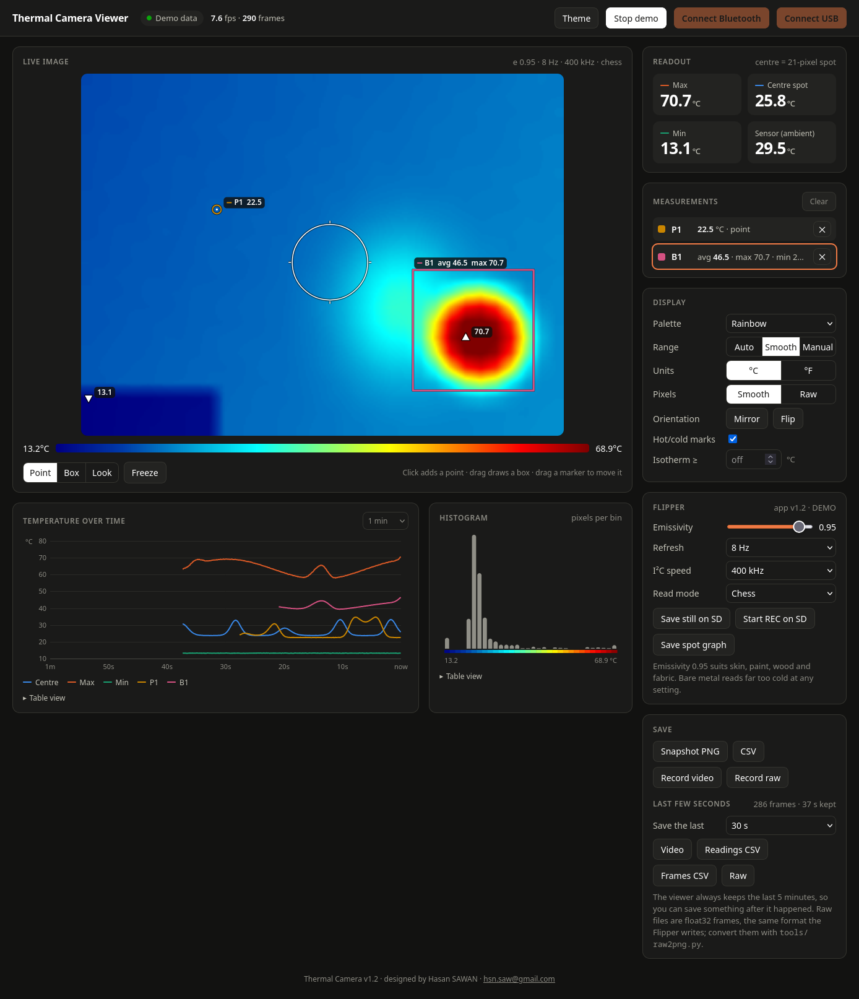
</div>

### Over USB

1. On the Flipper, go to mode **8 USB** and press **OK**. The screen shows *Waiting for PC*.
2. In the viewer, click **Connect USB** and choose the Flipper port ending in **ACM1** (Linux) or the second Flipper COM port (Windows).
3. The Flipper shows *STREAMING*.

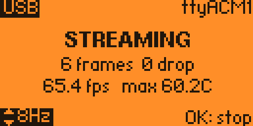

While streaming, the Flipper appears as two serial ports: the first stays its normal command line, the second carries the thermal stream. Press **OK** or change mode to stop; the Flipper returns to normal USB automatically.

*Linux: your user must be in the `dialout` group (`sudo usermod -aG dialout $USER`, then log out and back in).*

### Over Bluetooth

1. On the Flipper, go to mode **9 Bluetooth** and press **OK**. (If it says *Bluetooth is off*, turn it on in the Flipper's Settings → Bluetooth.)
2. In the viewer, click **Connect Bluetooth** and pick the device whose name starts with *Flipper*.
3. The first time, type the **PIN** shown on the Flipper into your computer's pairing prompt.

Bluetooth manages about **1–4 frames per second**, which is fine for watching something warm up or cool down. Close the Flipper phone app first, because the Flipper accepts one Bluetooth connection at a time.

<div align="center">
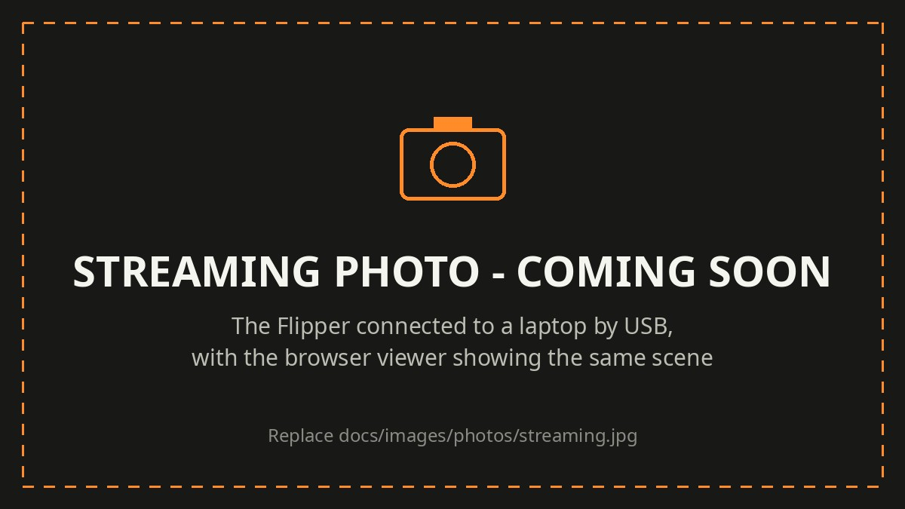
</div>

### Viewer features

| Feature | How |
|---|---|
| Large colour image | Five palettes, smooth or raw pixels, mirror / flip |
| Temperature under the cursor | Hover over the image |
| Measurement points | Click the image (up to 5; drag to move) |
| Measurement boxes | Drag on the image: average, max and min inside |
| Temperature over time | Every measurement plus max / centre / min, 30 s – 10 min |
| Histogram and isotherm | Distribution of temperatures; highlight everything above a value |
| Range | Auto, smoothed auto, or manual min / max |
| Freeze | Hold the picture while data keeps arriving |
| Save | Snapshot PNG (with scale and readings), CSV, video (WebM), raw recording |
| Save the last few seconds | Pick 10 s – 5 min and save it as video, readings CSV, frames CSV or raw, after the fact |
| Control the Flipper | Emissivity, refresh rate, I²C speed, read mode; save a still, start/stop recording, save the spot graph on the SD card |
| Demo | Try the viewer without a Flipper |

The stream protocol is documented in [docs/DEVELOPMENT.md](docs/DEVELOPMENT.md#usb-streaming) if you want to write your own client.

---

## Settings

Press **Back** on the camera screen. Changes apply immediately and are saved when you leave.

<details>
<summary><b>All settings</b> (click to expand)</summary>

| Setting | Options | What it does |
|---|---|---|
| **Range** | Auto / Auto Smooth / Manual | How the image is scaled. *Auto Smooth* avoids flicker |
| Range Min / Max | −40 – 300 °C | Fixed scale for *Manual* |
| **Interpolate** | On / Off | Smooth or blocky pixels |
| **Mirror** | On / Off | Flip left–right (useful when the sensor faces you) |
| **Units** | Celsius / Fahrenheit | Everywhere on screen |
| **Gamma** | 0.40 – 2.50 | Linear / Inverted contrast curve |
| **EQ Strength** | 0 – 100 % | Hist EQ amount |
| **Contour Step** | 0.5 – 10 ° | Spacing of contour lines |
| **Spot Size** | 1 / 3 / 5 / 7 px | Spot meter diameter |
| **Graph Time** | 10 s – 10 min | Spot meter history length |
| **Graph Log** | On / Off | Continuously append the spot history to a CSV log |
| **Body Offset** | −2.0 – +5.0 °C | Human mode: added to the skin reading |
| **Fever At** | 37.3 – 38.5 °C | Human mode: *HIGH* at or above this |
| **Low At** | 34.0 – 36.0 °C | Human mode: *LOW* at or below this |
| **Threshold** | Off / Above / Below / Band | Which pixels pass (Threshold view only) |
| Thr Low / High | −40 – 300 °C | Threshold values (High is used by Band) |
| **Emissivity** | 0.50 – 1.00 | Surface emissivity. 0.95 suits skin, paint, wood, fabric and plastic |
| **Refresh** | 0.5 – 64 Hz | Sensor frame rate |
| **I2C Speed** | 100 kHz / 400 kHz / 1 MHz | Faster = higher frame rate (needs good pull-ups; 1 MHz is experimental) |
| **Read Mode** | Chess / Interleave | Sensor readout pattern; Chess is recommended |
| **Palette** | Ironbow / Rainbow / Gray / HotMetal / Arctic | Colours for saved images |
| **Save As** | PNG / TIFF / PNG+TIFF | Still image format |
| **Img Size** | 32×24 to 256×192 | Saved image resolution |
| **Save CSV** | On / Off | Also save raw temperatures with each still |
| **Animation** | PNG seq / RAW bin | Recording format |
| **Factory Reset** | OK | Restore all defaults (saved files are kept) |
| **About** | OK | Version and author |
| **Exit App** | OK | Close the app |

</details>

---

## Saved files

Everything is saved on the SD card in **`thermal_cam/`**:

```
thermal_cam/
├── IR_20260925_143022.png        still, colour palette
├── IR_20260925_143022.tif        still, if TIFF is selected
├── IR_20260925_143022.csv        raw temperatures in °C (24 rows × 32 values)
├── IR_20260925_143022_graph.csv  spot graph: time, min, max, last
├── LOG_20260925_140000.csv       continuous spot log (Graph Log on)
├── REC_20260925_143101/
│   ├── f00000.png ...            recording as PNG frames, or
│   └── frames.bin                recording as raw data
└── settings.bin
```

Convert raw recordings on your computer with [`tools/raw2png.py`](tools/raw2png.py):

```bash
pip install --user Pillow
python3 tools/raw2png.py frames.bin                   # one PNG per frame
python3 tools/raw2png.py frames.bin --gif out.gif     # animated GIF
python3 tools/raw2png.py frames.bin --range 20 40     # fixed colour scale
```

---

## Troubleshooting

| Symptom | Fix |
|---|---|
| **No sensor found** | Check the wiring, especially SDA (15) and SCL (16), which are easy to swap. The sensor can be plugged in while the app runs |
| **I2C error** | Set I2C Speed to 100 kHz, or add 2.2k–4.7k pull-ups and shorten the wires |
| **Bad calibration** | Usually signal quality, not a dead sensor. Try 100 kHz |
| Metal reads far too cold | Normal: shiny metal has very low emissivity. Put matte tape on the spot you measure |
| Low frame rate | Use 400 kHz I²C and a Refresh of 8 Hz or more |
| Half the image lags on fast movement | Normal in Chess mode (each frame updates half the pixels) |
| App won't start: *API mismatch* | Install from the catalog, or rebuild with `ufbt update` for your firmware |
| Viewer: *no Web Serial* | Use Chrome, Chromium or Edge |
| Viewer: *that is the command-line port* | Reconnect and choose the second Flipper port (**ACM1**) |
| Flipper shows *USB busy* | Close qFlipper or any app holding USB, then press OK again |
| Bluetooth: Flipper does not appear | Close the Flipper phone app and make sure the Flipper shows *Waiting for PC* |
| Bluetooth: connected, no picture | Unpair the Flipper in your computer's Bluetooth settings and reconnect |
| Human mode reads low | Normal for skin at a distance. Get closer and calibrate **Body Offset** |

---

## Building from source

You need [uFBT](https://pypi.org/project/ufbt/), the Flipper app build tool.

```bash
pipx install ufbt                  # or: python3 -m pip install --user ufbt
ufbt update                        # SDK for official release firmware
# ufbt update --channel=dev        # official dev firmware
# ufbt update --index-url=https://up.momentum-fw.dev/firmware/directory.json   # Momentum

git clone https://github.com/YOUR_GITHUB_USERNAME/flipper-thermal-camera.git
cd flipper-thermal-camera
ufbt                               # build -> dist/thermal_cam.fap
ufbt launch                        # build, install and start on a connected Flipper
```

Architecture, threading, the I²C workarounds, the settings file and the stream protocol are described in [docs/DEVELOPMENT.md](docs/DEVELOPMENT.md).

---

## License and credits

Designed and developed by **Hasan SAWAN**.

Released under the [Apache License 2.0](LICENSE). The sensor calibration code is adapted from the [Melexis MLX90640 library](https://github.com/melexis/mlx90640-library) (Apache 2.0, © 2017 Melexis N.V.); see [NOTICE](NOTICE).

Version history: [docs/CHANGELOG.md](docs/CHANGELOG.md)

<div align="center">

</div>
