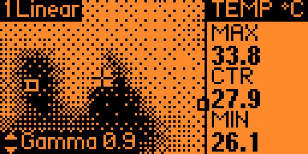
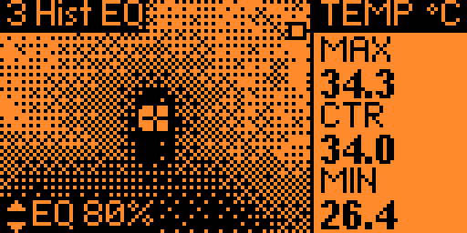
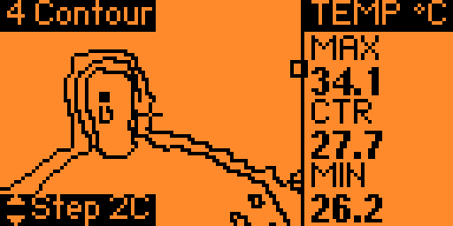
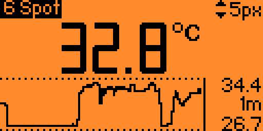
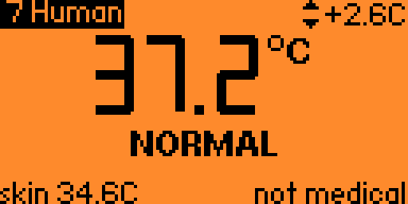
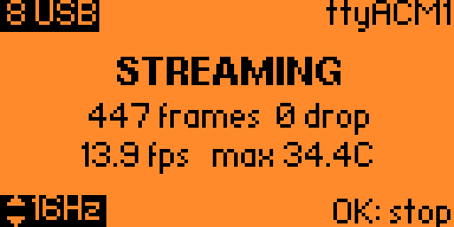

<div align="center">

# Thermal Camera for Flipper Zero

Turn your Flipper Zero into a thermal camera with an MLX90640 32×24 infrared sensor.

[](https://github.com/HasanSawan/flipper_thermal_camera/actions/workflows/build.yml)
[](LICENSE)


### Demo video

[](https://www.youtube.com/watch?v=FziZeKUH8gE)

[Discussion on Reddit](https://www.reddit.com/r/flipperzero/comments/1wqqs9u/i_turned_my_flipper_zero_into_a_thermal_camera/)

</div>

## Features

- Live thermal image with max, centre and min temperatures
- Nine view modes: Linear, Inverted, Hist EQ, Contour, Threshold, Spot, Human, USB and Bluetooth
- Spot meter with a temperature-history graph
- Human mode: body-temperature screening estimate (**not a medical device**)
- Save stills as PNG, TIFF and CSV, and record animations
- Live streaming over USB or Bluetooth to a browser viewer ([`tools/viewer.html`](tools/viewer.html))

## Screenshots

| | |
|:---:|:---:|
|  |  |
| Linear | Hist EQ |
|  |  |
| Contour | Spot meter |
|  |  |
| Human | USB streaming |

## Wiring

| MLX90640 | Flipper pin |
|---|---|
| VIN | 9 (3.3 V) |
| GND | 18 |
| SDA | 15 (C1) |
| SCL | 16 (C0) |

> [!WARNING]
> Use pin 9 (3.3 V), not pin 1 (5 V).

If you get I2C errors, set **I2C Speed** to 100 kHz in Settings, or add 2.2k–4.7k pull-up resistors from SDA and SCL to 3.3 V.

## Controls

| Key | Action |
|---|---|
| OK | Save a still. In USB / Bluetooth mode: start or stop streaming |
| Hold OK | Record while held |
| Left / Right | Change view mode |
| Up / Down | Adjust the current mode's setting |
| Back | Settings |
| Hold Back | Exit |

## Streaming

Open [`tools/viewer.html`](tools/viewer.html) in Chrome, Chromium or Edge.

- **USB:** select mode 8 USB on the Flipper, press OK, then click **Connect USB** in the viewer and choose the second Flipper serial port.
- **Bluetooth:** select mode 9 Bluetooth, press OK, then click **Connect Bluetooth**.

## Saved files

Everything is saved on the SD card in `thermal_cam/`. Raw recordings can be converted with [`tools/raw2png.py`](tools/raw2png.py).

## Building

```bash
pip install ufbt
ufbt update
ufbt            # build -> dist/thermal_cam.fap
ufbt launch     # build, install and run on a connected Flipper
```

## License

Apache License 2.0, by Hasan SAWAN. The sensor calibration code is adapted from the [Melexis MLX90640 library](https://github.com/melexis/mlx90640-library); see [NOTICE](NOTICE). Version history: [docs/CHANGELOG.md](docs/CHANGELOG.md).
